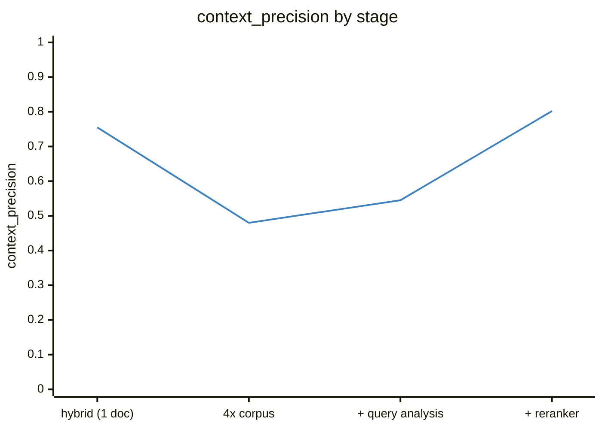

# Hybrid RAG over SEC 10-K filings

A RAG system I built over SEC 10-K filings: hybrid retrieval (dense + BM25 + RRF + rerank), per-claim citation verification, and an eval pipeline that measured every change I made along the way.

[](https://github.com/ikerpindter/RAG/actions/workflows/ci.yml)

I froze every architecture stage as a versioned baseline. Each file under [`evals/`](evals/) documents its Ragas metrics, the judge used and the known issues at that point:

| Stage | Corpus | Questions | faithfulness | answer_relevancy | context_precision | context_recall |
|---|---|---|---|---|---|---|
| [Hybrid + citations](evals/baseline_hybrid.json) | 1 doc | 12 | 0.981 | 0.861 | 0.755 | 0.861 |
| [4x corpus](evals/baseline_full_corpus.json) | 4 docs | 20 | 0.810 | 0.809 | 0.480 | 0.613 |
| [+ query analysis](evals/baseline_smart_retrieval.json) | 4 docs | 20 | 0.921 | 0.875 | 0.545 | 0.738 |
| [+ reranker](evals/baseline_reranker.json) | 4 docs | 20 | 0.965 | 0.932 | 0.802 | 0.912 |

Here is the context_precision curve on its own, since it tells the story best:



The drop in row 2 is the interesting part. Going from one filing to four (Lennar and D.R. Horton, FY2023 and FY2024) made the problem realistic: consecutive-year filings from the same company are textual near-twins, and retrieval quality collapsed until the pipeline learned to tell them apart. Also worth knowing: the first row uses an easier, smaller gold set (12 questions, single document), so it is not directly comparable to the other three.

## What makes this different

- **I wrote the gold set by hand, no synthetic generation.** I work in finance, so the 20 questions and their reference answers came from me reading the filings, including deliberate traps. My favorite: the guarantor-subsidiary summarized figures ($32.6B "total revenues") that sit a few chunks away from the consolidated income statement ($35.4B) and would fool a careless reference.
- **The eval caught a real hallucination, and the fix was retrieval, not prompting.** On the 4x corpus, one question produced invented revenue figures that scored 0.95 on answer relevancy while faithfulness exposed them at 0.00 ([baseline_full_corpus.json](evals/baseline_full_corpus.json), q16). After the reranker, that same question scores 1.00/1.00 on context metrics. I never touched the prompt to fix it.
- **I diagnosed cross-year contamination and measured the fix.** Asking for Lennar's FY2024 revenues retrieved FY2023 chunks (context precision and recall both 0.00). Metadata filtering from query analysis took it to 1.00/1.00. The failure, the diagnosis and the fix are all sitting in the versioned baselines if you want to check.
- **Comparative questions get reranked per company.** Reranking a merged candidate pool would let one company dominate the top-k and destroy the coverage guarantee that query decomposition exists to provide. So each per-company sub-retrieval gets reranked on its own (top-4 per company).
- **Citations are verifiable and the sources section cannot be hallucinated.** The model only emits inline `[n]` markers; the sources list is rendered by my code from retrieval metadata. With `--verify`, every cited claim gets checked against its cited chunk by a cheap LLM verdict.

## Architecture

```
question
  │
  ├─ query analysis ──── {companies, fiscal_years, comparative}   (strict JSON,
  │                       validated against the corpus catalog; empty = no filter)
  ▼
metadata-filtered hybrid retrieval
  dense (cosine over normalized embeddings)  +  BM25 (rebuilt on the filtered subset)
  fused with Reciprocal Rank Fusion (k=60)
  [comparative: one sub-retrieval per company]
  ▼
rerank: RRF pool of 20 → top-5   (per company when comparative: pool 20 → top-4 each)
  ▼
generation with inline citations [n]   (extracts labeled with company + fiscal year)
  ▼
sources section built from retrieval metadata (not model output)
optional --verify: per-claim support check against the cited chunks
```

| Component | Implementation | Model (swappable in [src/config.py](src/config.py)) |
|---|---|---|
| Embeddings | OpenAI | `text-embedding-3-small` |
| Generation | OpenAI Responses API | `gpt-5.4-nano` |
| Query analysis | OpenAI, strict JSON + catalog validation | `gpt-5.4-nano` |
| Citation verification | OpenAI, binary verdict per claim | `gpt-5.4-nano` |
| Reranker | Cohere (`RERANKER_ENABLED` flag = control group) | `rerank-v4.0-pro` |
| Eval metrics | Ragas 0.4.3 (collections API) | judge: `gpt-5.4-nano` |
| Vector store | numpy, one index file per document, no infra | none |
| Keyword search | rank-bm25 (BM25Okapi) | none |

## Design decisions

- **Why 10-K filings.** Long, public, verifiable documents whose consecutive-year editions are structurally near-identical. That makes for a retrieval problem that actually punishes sloppy pipelines, unlike toy corpora.
- **Why evals before the reranker.** I deliberately built the reranker last so it would have numeric targets written in advance (three questions stuck at 0.00 on context metrics, precision at 0.545). Its +0.257 precision gain is measured against a frozen baseline, not assumed.
- **Why a manual gold set.** For 20 questions, writing references myself was cheaper than generating them, catches subtleties like consolidated vs. subsidiary figures, and makes the eval numbers trustworthy. If I can't trust the gold set, no number downstream means anything.
- **Why RRF.** Cosine similarities and BM25 scores live on incomparable scales. RRF fuses rankings using positions only, with the standard k=60, and needs no score normalization.
- **Why re-ingest instead of migrating the index.** Chunking is deterministic, so rebuilding the whole 4-document index cost about $0.01 of embeddings. That beats writing and trusting migration code. One index file per document also makes ingestion idempotent per document.
- **Why no silent fallbacks.** Malformed analyzer JSON, out-of-catalog values, missing API keys and persistent Cohere 429s all stop with explicit errors. A pipeline that silently degrades (say, skipping the reranker) contaminates every experiment that runs on top of it without telling you.

## Running it

You need [uv](https://docs.astral.sh/uv/), an OpenAI API key and a Cohere API key (the free trial tier is enough; 429s get retried with a visible warning).

```bash
uv sync
cp .env.example .env        # fill OPENAI_API_KEY and COHERE_API_KEY

# One-time ingestion: downloads the 4 filings from SEC EDGAR, chunks, embeds (~$0.01)
uv run python -m src.ingest

# Ask questions (fractions of a cent each)
uv run python -m src.query "What was the dollar value of Lennar's backlog at November 30, 2024?"
uv run python -m src.query "Compare Lennar and D.R. Horton total revenues in fiscal 2024." --debug
uv run python -m src.query "How many homes did Lennar deliver in fiscal year 2024?" --verify

# Eval harness over the gold set (~$0.10-0.15 per full run with the nano judge)
uv run python -m evals.harness
uv run python -m evals.harness --limit 2   # cheap smoke test

# Tests: deterministic, no API keys, no network (same command CI runs)
uv run pytest
```

## Honest limitations

- **The judge is a cheap model.** `gpt-5.4-nano` runs with `temperature` forced to 1.0 (reasoning models accept no other value), which produces a documented ±0.03 run-to-run variance on context metrics plus occasional verdict errors. I recorded both in the baseline metadata instead of averaging them away.
- **Cross-company context_precision reads 0.00 and it is a metric false negative.** The judge does not credit per-company contexts against combined references, even when the answers are correct and supported. That is a limitation of the metric setup, not of retrieval, and it is noted in [baseline_reranker.json](evals/baseline_reranker.json).
- **Financial tables are handled pragmatically.** Table rows get flattened to `cell | cell | cell` text at ingestion. There is no deep tabular understanding here; table questions usually work because the relevant row survives flattening, not because the system parses structure.
- **The corpus is 4 documents on purpose.** Small enough to iterate fast and re-ingest for cents, structured enough (2 companies, 2 fiscal years) to reproduce real retrieval failures. It is not a scale demonstration.
- **Phrasing sensitivity is real.** Before the reranker, two phrasings of the same revenue question retrieved different chunks and one produced a wrong answer. The reranker fixed the case I measured, but the underlying sensitivity of embedding retrieval does not disappear.
